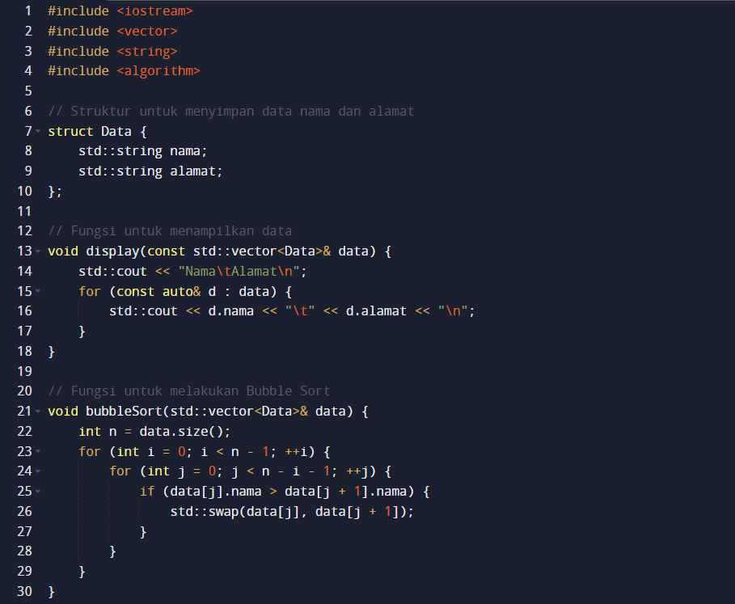
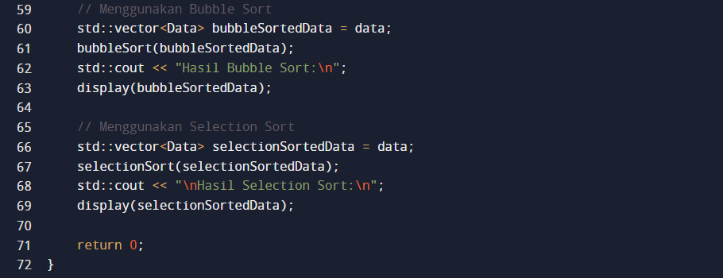
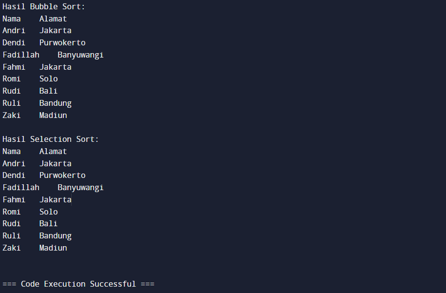
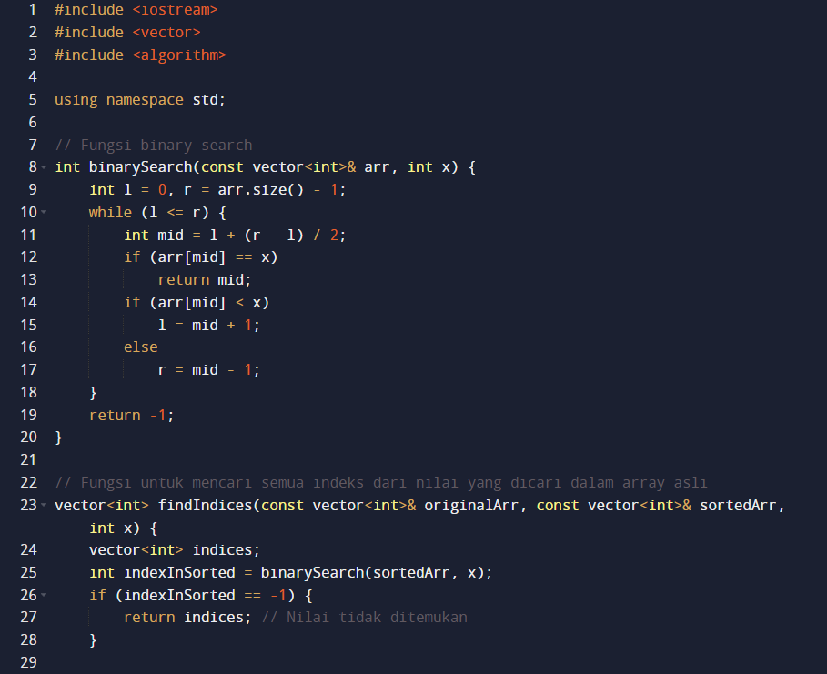
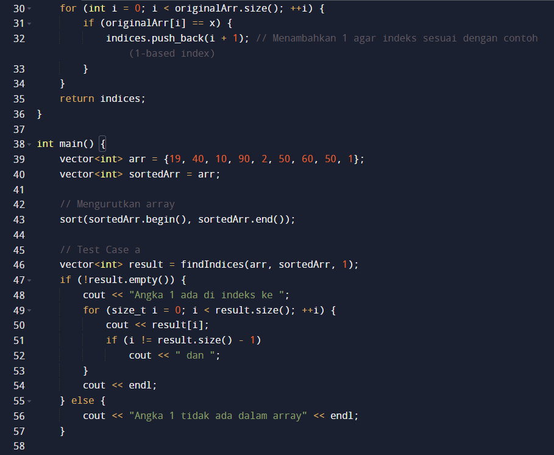
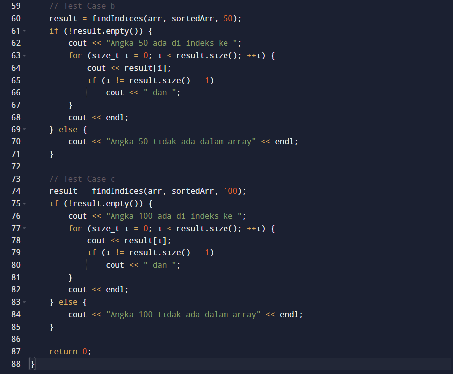

## Identitas Mahasiswa
- Nama Mahasiswa	: `Aryo Tegar Pradigdo`
- NIM	            : `230401070201`
- Mata Kuliah	    : `Struktur Data dan Algoritma`
- Kelas	        : `IT201`
- Prodi	        : `Informatika PJJ S1`

# Penjelasan Program C++ untuk Mengurutkan Data Menggunakan Bubble Sort dan Selection Sort

## Struktur Data
Program ini menggunakan struktur data yang disebut `Data`, yang menyimpan dua atribut: `nama` dan `alamat`. Setiap elemen data akan disimpan dalam sebuah vektor.

## Fungsi Display
Fungsi `display` bertanggung jawab untuk menampilkan data dalam format tabel dengan dua kolom: Nama dan Alamat. Fungsi ini menerima parameter berupa referensi konstan ke vektor data, memastikan tidak ada perubahan pada data asli saat ditampilkan.

## Fungsi Bubble Sort
Fungsi `bubbleSort` mengurutkan data berdasarkan nama menggunakan algoritma Bubble Sort. Algoritma ini bekerja dengan cara:
1. Mengiterasi elemen-elemen dalam vektor data beberapa kali.
2. Pada setiap iterasi, membandingkan elemen saat ini dengan elemen berikutnya.
3. Jika elemen saat ini lebih besar dari elemen berikutnya, kedua elemen tersebut ditukar.
4. Proses ini diulangi sampai seluruh elemen dalam vektor terurut.

## Fungsi Selection Sort
Fungsi `selectionSort` mengurutkan data berdasarkan nama menggunakan algoritma Selection Sort. Algoritma ini bekerja dengan cara:
1. Mengiterasi elemen-elemen dalam vektor data.
2. Untuk setiap elemen, mencari elemen terkecil dari sisa elemen yang belum diurutkan.
3. Menukar elemen terkecil yang ditemukan dengan elemen saat ini.
4. Proses ini diulangi sampai seluruh elemen dalam vektor terurut.

## Fungsi Utama (main)
Fungsi utama (`main`) menjalankan langkah-langkah berikut:
1. Menginisialisasi vektor data dengan data awal yang terdiri dari beberapa nama dan alamat.
2. Membuat salinan vektor data untuk diurutkan menggunakan Bubble Sort.
3. Memanggil fungsi `bubbleSort` untuk mengurutkan salinan data tersebut.
4. Menampilkan hasil pengurutan menggunakan fungsi `display`.
5. Membuat salinan lain dari vektor data untuk diurutkan menggunakan Selection Sort.
6. Memanggil fungsi `selectionSort` untuk mengurutkan salinan data tersebut.
7. Menampilkan hasil pengurutan menggunakan fungsi `display`.

## Screenshot Kode Program

## Screenshot Output Program

# Penjelasan Program C++ Pencarian Data dalam Sebuah Kumpulan Array Menggunakan Binary Search

## Struktur Data
Program ini menggunakan dua struktur data: `originalArr` dan `sortedArr`. `originalArr` adalah array asli yang menyimpan elemen-elemen data, sementara `sortedArr` adalah salinan dari array asli yang diurutkan. Kedua array ini disimpan dalam vektor.

## Fungsi Binary Search
Fungsi `binarySearch` bertanggung jawab untuk mencari indeks suatu nilai dalam array yang sudah diurutkan menggunakan algoritma Binary Search. Algoritma ini bekerja dengan cara:
1. Menetapkan batas kiri (`l`) dan kanan (`r`) dari pencarian.
2. Mengiterasi selama batas kiri tidak melebihi batas kanan.
3. Menghitung nilai tengah (`mid`) dari batas kiri dan kanan.
4. Membandingkan nilai tengah dengan nilai yang dicari (`x`):
    - Jika nilai tengah sama dengan `x`, indeks nilai tengah dikembalikan.
    - Jika nilai tengah lebih kecil dari `x`, batas kiri digeser ke `mid + 1`.
    - Jika nilai tengah lebih besar dari `x`, batas kanan digeser ke `mid - 1`.
5. Jika nilai tidak ditemukan, fungsi mengembalikan -1.

## Fungsi Pencarian Indeks
Fungsi `findIndices` bertanggung jawab untuk mencari semua indeks dari nilai yang dicari dalam array asli. Fungsi ini bekerja dengan cara:
1. Memanggil fungsi `binarySearch` untuk mencari nilai dalam array yang diurutkan.
2. Jika nilai ditemukan (`binarySearch` tidak mengembalikan -1), mengiterasi melalui array asli untuk menemukan semua indeks dari nilai tersebut.
3. Menambahkan indeks-indeks yang ditemukan ke dalam vektor hasil (`indices`) dengan penyesuaian ke format 1-based index.
4. Mengembalikan vektor `indices` yang berisi semua indeks dari nilai yang dicari dalam array asli.

## Fungsi Utama (main)
Fungsi utama (`main`) menjalankan langkah-langkah berikut:
1. Menginisialisasi vektor `arr` dengan data awal yang terdiri dari beberapa angka.
2. Membuat salinan `sortedArr` dari array `arr`.
3. Mengurutkan `sortedArr` menggunakan fungsi `sort`.
4. Meminta input dari pengguna untuk nilai yang ingin dicari.
5. Memanggil fungsi `findIndices` untuk mencari nilai yang diinput oleh pengguna dalam array `arr`.
6. Menampilkan hasil pencarian:
    - Jika nilai ditemukan, mencetak semua indeks di mana nilai tersebut ditemukan.
    - Jika nilai tidak ditemukan, mencetak bahwa nilai tersebut tidak ada dalam array.

## Screenshot Kode Program

## Screenshot Output Program
